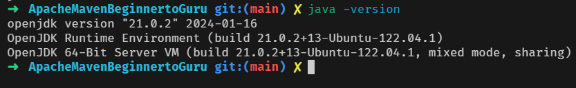
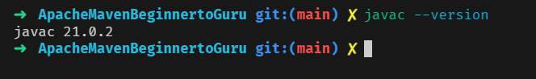
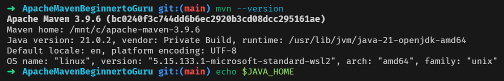

# 02 - Getting Started

[maven installation](./003%20Maven%20Installation.html)

## 004 Environment Verification

```bash
java -version
javac -version
```





```bash
mvn -v
```



this is not mandatory, but it is a good practice to verify the environment variables are set correctly.

```bash
echo $JAVA_HOME
```
