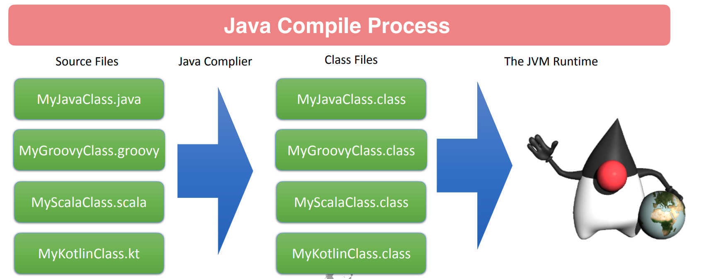
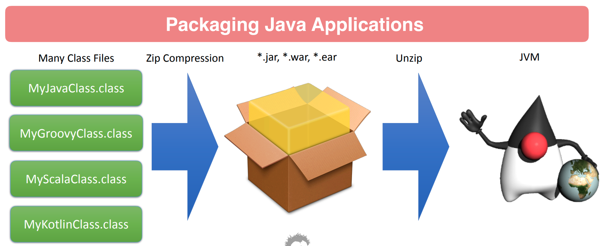
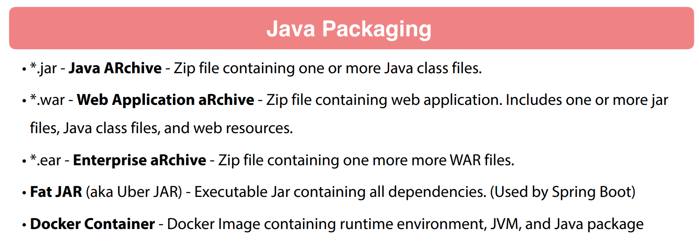
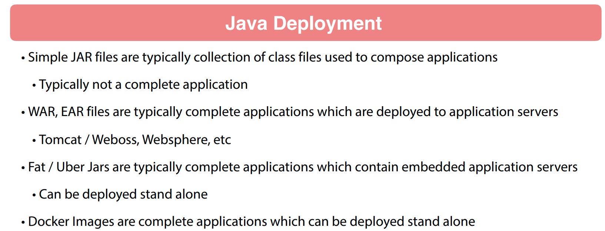

# 03 - Compiling Java

## 001 Introduction

going back to basics, we will review how to compile and package Java applications from the command line. This is important to understand how Java applications are built and how to use the command line to compile and package Java applications.

## 002 Review of Java Compile and Packaging

## 003 Hello World Java Command Line

## 004 Creating Java jar files from Command Line

## 005 Using 3rd Party Jars with Command Line Java
