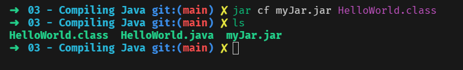

# 03 - Compiling Java

## 001 Introduction

going back to basics, we will review how to compile and package Java applications from the command line. This is important to understand how Java applications are built and how to use the command line to compile and package Java applications.

## 002 Review of Java Compile and Packaging


## 003 Hello World Java Command Line

create a simple Java application that prints "Hello, World!" to the console. This will be a simple Java application that we will compile and run from the command line.

```java
public class HelloWorld {
    public static void main(String[] args) {
        System.out.println("Hello, World!");
    }
}
```

```bash
javac HelloWorld.java
```


.class file is the compiled Java file that can be run using the `java` command.
this is called compiled bytecode.

```bash
java HelloWorld
```


## 004 Creating Java jar files from Command Line

let's create a jar file from the HelloWorld application. This will allow us to package the application into a single file that can be run on any system with the Java runtime installed.

```bash
jar cf myJar.jar HelloWorld.class
```



let's run the HelloWorld application from the jar file.

```bash
java -classpath myJar.jar HelloWorld
```


let's unzip the jar file to see the contents.

```bash
unzip myJar.jar
```


## 005 Using 3rd Party Jars with Command Line Java


```bash
javac -classpath ./lib/* HelloWorld.java
```

```bash
java -classpath ./lib/commons-lang3-3.8.1.jar:./ HelloWorld
```
