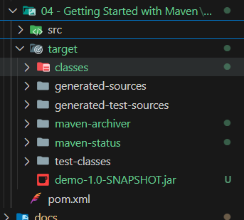

# 04 - Getting Started with Maven

## 002 Compiling and Packaging with Maven

go to your project directory and run the following command to compile the project.

```bash
mvn compile
```

to remove the compiled files, run the following command.

```bash
mvn clean
```

to package the project into a jar file, run the following command.

```bash
mvn package
```



## 003 Including Dependencies with Maven

```java
package com.example;

import org.apache.commons.lang3.StringUtils;

public class Main {
    public static void main(String[] args) {
        System.out.println("Hello world!");
        System.out.println(StringUtils.capitalize("hello world!"));
    }
}
```

let's add the following dependency to the `pom.xml` file.

```xml
    <dependencies>
        <dependency>
        <groupId>org.apache.commons</groupId>
        <artifactId>commons-lang3</artifactId>
        <version>3.12.0</version>
    </dependency>
```

complete `pom.xml` file.

```xml
<?xml version="1.0" encoding="UTF-8"?>
<project xmlns="http://maven.apache.org/POM/4.0.0"
         xmlns:xsi="http://www.w3.org/2001/XMLSchema-instance"
         xsi:schemaLocation="http://maven.apache.org/POM/4.0.0 http://maven.apache.org/xsd/maven-4.0.0.xsd">
    <modelVersion>4.0.0</modelVersion>

    <groupId>com.example</groupId>
    <artifactId>demo</artifactId>
    <version>1.0-SNAPSHOT</version>

    <properties>
        <project.build.sourceEncoding>UTF-8</project.build.sourceEncoding>
        <project.reporting.outputEncoding>UTF-8</project.reporting.outputEncoding>
        <java.version>21</java.version>
        <maven.compiler.source>${java.version}</maven.compiler.source>
        <maven.compiler.target>${java.version}</maven.compiler.target>
    </properties>
    <dependencies>
        <dependency>
        <groupId>org.apache.commons</groupId>
        <artifactId>commons-lang3</artifactId>
        <version>3.12.0</version>
    </dependency>
    </dependencies>
</project>
```

to include the dependencies, run the following command.

```bash
mvn compile
```

to run the project, run the following command.

```bash
mvn exec:java -Dexec.mainClass="com.example.Main"
```

## 004 Creating a new Maven Project with IntelliJ

## 005 Assignment - Add StringUtils Dep to Project

## 006 Assignment Review - Add StringUtils Dep to Project
