# 05 - Maven Basics

## 002 Maven Coordinates

maven coordinates are used to identify a project. it consists of three parts: `groupId`, `artifactId`, and `version`.
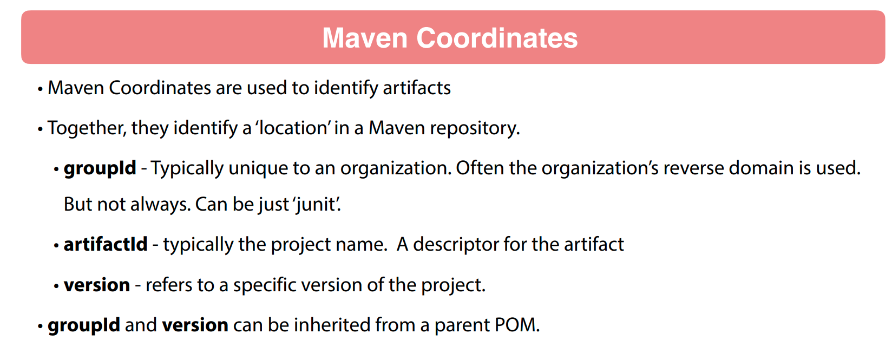
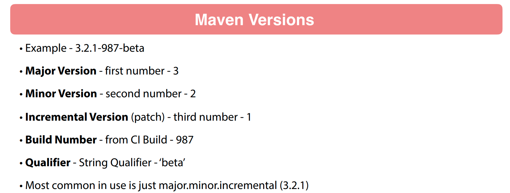
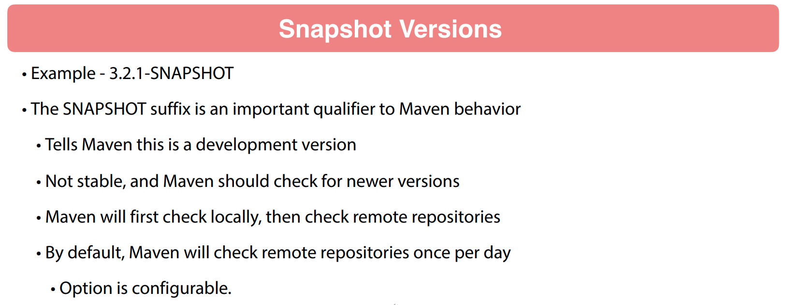

## 003 Maven Repositories

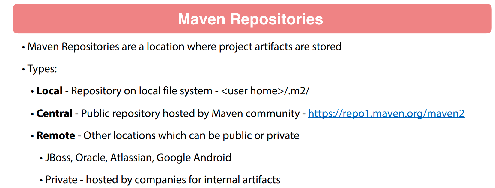

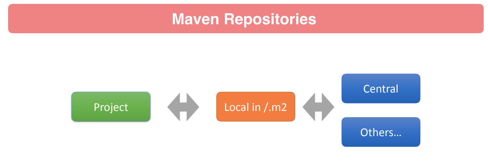

<https://mvnrepository.com/artifact/org.apache.commons/commons-lang3/3.14.0>

<https://central.sonatype.com/artifact/org.apache.commons/commons-lang3>

## 004 Maven Wagon

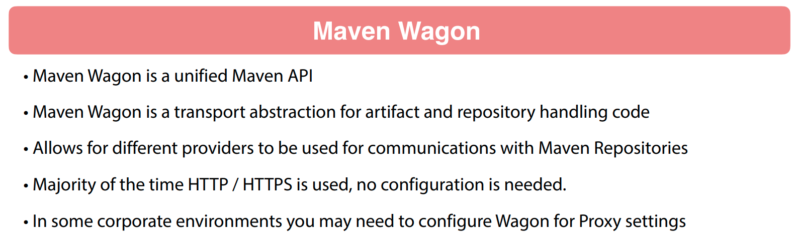

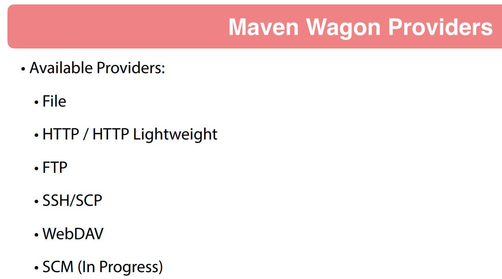

## 005 Maven Project Object Model

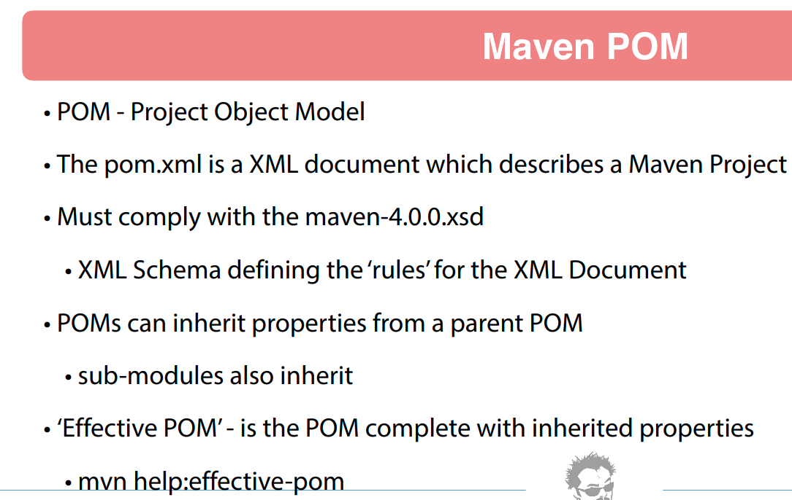

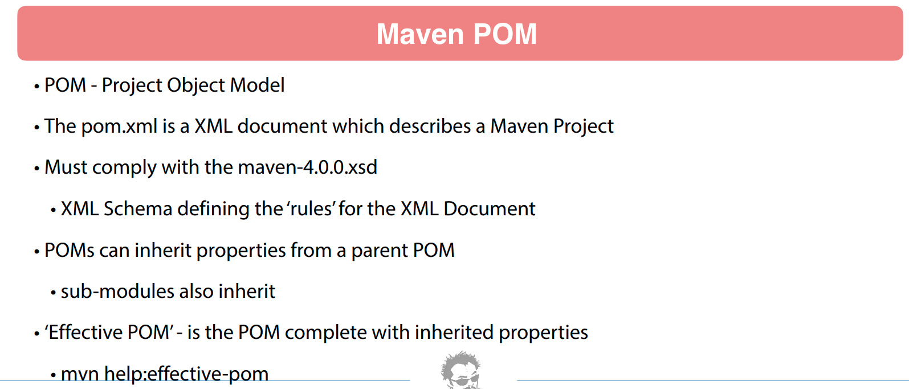

```xml
<?xml version="1.0" encoding="UTF-8"?>
<project xmlns="http://maven.apache.org/POM/4.0.0"
         xmlns:xsi="http://www.w3.org/2001/XMLSchema-instance"
         xsi:schemaLocation="http://maven.apache.org/POM/4.0.0 http://maven.apache.org/xsd/maven-4.0.0.xsd">
    <modelVersion>4.0.0</modelVersion>

    <groupId>com.wchamara</groupId>
    <artifactId>sample-app</artifactId>
    <version>1.0-SNAPSHOT</version>

    <properties>
        <project.build.sourceEncoding>UTF-8</project.build.sourceEncoding>
        <project.reporting.outputEncoding>UTF-8</project.reporting.outputEncoding>
        <java.version>21</java.version>
        <maven.compiler.source>${java.version}</maven.compiler.source>
        <maven.compiler.target>${java.version}</maven.compiler.target>
    </properties>
    <dependencies>
        <dependency>
            <groupId>org.apache.commons</groupId>
            <artifactId>commons-lang3</artifactId>
            <version>3.14.0</version>
        </dependency>

    </dependencies>

</project>
```

```xml
<!-- ====================================================================== -->
<!--                                                                        -->
<!-- Generated on 2024-05-16T12:11:14                                       -->
<!--                                                                        -->
<!-- ====================================================================== -->

<!-- ====================================================================== -->
<!--                                                                        -->
<!-- Effective POM for project 'com.wchamara:sample-app:jar:1.0-SNAPSHOT'   -->
<!--                                                                        -->
<!-- ====================================================================== -->

<project xmlns="http://maven.apache.org/POM/4.0.0" xmlns:xsi="http://www.w3.org/2001/XMLSchema-instance" xsi:schemaLocation="http://maven.apache.org/POM/4.0.0 https://maven.apache.org/xsd/maven-4.0.0.xsd">
  <modelVersion>4.0.0</modelVersion>
  <groupId>com.wchamara</groupId>
  <artifactId>sample-app</artifactId>
  <version>1.0-SNAPSHOT</version>

  <properties>
    <java.version>21</java.version>
    <maven.compiler.source>21</maven.compiler.source>
    <maven.compiler.target>21</maven.compiler.target>
    <project.build.sourceEncoding>UTF-8</project.build.sourceEncoding>
    <project.reporting.outputEncoding>UTF-8</project.reporting.outputEncoding>
  </properties>

  <dependencies>
    <dependency>
      <groupId>org.apache.commons</groupId>
      <artifactId>commons-lang3</artifactId>
      <version>3.14.0</version>
      <scope>compile</scope>
    </dependency>
  </dependencies>

  <repositories>
    <repository>
      <snapshots>
        <enabled>false</enabled>
      </snapshots>
      <id>central</id>
      <name>Central Repository</name>
      <url>https://repo.maven.apache.org/maven2</url>
    </repository>
  </repositories>

  <pluginRepositories>
    <pluginRepository>
      <releases>
        <updatePolicy>never</updatePolicy>
      </releases>
      <snapshots>
        <enabled>false</enabled>
      </snapshots>
      <id>central</id>
      <name>Central Repository</name>
      <url>https://repo.maven.apache.org/maven2</url>
    </pluginRepository>
  </pluginRepositories>

  <build>
    <sourceDirectory>C:\Users\USER\Documents\GitHub\ApacheMavenBeginnertoGuru\code\04 - Getting Started with Maven\sample-app\src\main\java</sourceDirectory>
    <scriptSourceDirectory>C:\Users\USER\Documents\GitHub\ApacheMavenBeginnertoGuru\code\04 - Getting Started with Maven\sample-app\src\main\scripts</scriptSourceDirectory>
    <testSourceDirectory>C:\Users\USER\Documents\GitHub\ApacheMavenBeginnertoGuru\code\04 - Getting Started with Maven\sample-app\src\test\java</testSourceDirectory>
    <outputDirectory>C:\Users\USER\Documents\GitHub\ApacheMavenBeginnertoGuru\code\04 - Getting Started with Maven\sample-app\target\classes</outputDirectory>
    <testOutputDirectory>C:\Users\USER\Documents\GitHub\ApacheMavenBeginnertoGuru\code\04 - Getting Started with Maven\sample-app\target\test-classes</testOutputDirectory>

    <resources>
      <resource>
        <directory>C:\Users\USER\Documents\GitHub\ApacheMavenBeginnertoGuru\code\04 - Getting Started with Maven\sample-app\src\main\resources</directory>
      </resource>
    </resources>

    <testResources>
      <testResource>
        <directory>C:\Users\USER\Documents\GitHub\ApacheMavenBeginnertoGuru\code\04 - Getting Started with Maven\sample-app\src\test\resources</directory>
      </testResource>
    </testResources>

    <directory>C:\Users\USER\Documents\GitHub\ApacheMavenBeginnertoGuru\code\04 - Getting Started with Maven\sample-app\target</directory>
    <finalName>sample-app-1.0-SNAPSHOT</finalName>

    <pluginManagement>
      <plugins>
        <plugin>
          <artifactId>maven-antrun-plugin</artifactId>
          <version>3.1.0</version>
        </plugin>
        <plugin>
          <artifactId>maven-assembly-plugin</artifactId>
          <version>3.6.0</version>
        </plugin>
        <plugin>
          <artifactId>maven-dependency-plugin</artifactId>
          <version>3.6.1</version>
        </plugin>
        <plugin>
          <artifactId>maven-release-plugin</artifactId>
          <version>3.0.1</version>
        </plugin>
      </plugins>
    </pluginManagement>

    <plugins>
      <plugin>
        <artifactId>maven-clean-plugin</artifactId>
        <version>3.2.0</version>
        <executions>
          <execution>
            <id>default-clean</id>
            <phase>clean</phase>
            <goals>
              <goal>clean</goal>
            </goals>
          </execution>
        </executions>
      </plugin>
      <plugin>
        <artifactId>maven-resources-plugin</artifactId>
        <version>3.3.1</version>
        <executions>
          <execution>
            <id>default-testResources</id>
            <phase>process-test-resources</phase>
            <goals>
              <goal>testResources</goal>
            </goals>
          </execution>
          <execution>
            <id>default-resources</id>
            <phase>process-resources</phase>
            <goals>
              <goal>resources</goal>
            </goals>
          </execution>
        </executions>
      </plugin>
      <plugin>
        <artifactId>maven-jar-plugin</artifactId>
        <version>3.3.0</version>
        <executions>
          <execution>
            <id>default-jar</id>
            <phase>package</phase>
            <goals>
              <goal>jar</goal>
            </goals>
          </execution>
        </executions>
      </plugin>
      <plugin>
        <artifactId>maven-compiler-plugin</artifactId>
        <version>3.11.0</version>
        <executions>
          <execution>
            <id>default-compile</id>
            <phase>compile</phase>
            <goals>
              <goal>compile</goal>
            </goals>
          </execution>
          <execution>
            <id>default-testCompile</id>
            <phase>test-compile</phase>
            <goals>
              <goal>testCompile</goal>
            </goals>
          </execution>
        </executions>
      </plugin>
      <plugin>
        <artifactId>maven-surefire-plugin</artifactId>
        <version>3.2.2</version>
        <executions>
          <execution>
            <id>default-test</id>
            <phase>test</phase>
            <goals>
              <goal>test</goal>
            </goals>
          </execution>
        </executions>
      </plugin>
      <plugin>
        <artifactId>maven-install-plugin</artifactId>
        <version>3.1.1</version>
        <executions>
          <execution>
            <id>default-install</id>
            <phase>install</phase>
            <goals>
              <goal>install</goal>
            </goals>
          </execution>
        </executions>
      </plugin>
      <plugin>
        <artifactId>maven-deploy-plugin</artifactId>
        <version>3.1.1</version>
        <executions>
          <execution>
            <id>default-deploy</id>
            <phase>deploy</phase>
            <goals>
              <goal>deploy</goal>
            </goals>
          </execution>
        </executions>
      </plugin>
      <plugin>
        <artifactId>maven-site-plugin</artifactId>
        <version>3.12.1</version>
        <executions>
          <execution>
            <id>default-site</id>
            <phase>site</phase>
            <goals>
              <goal>site</goal>
            </goals>
            <configuration>
              <outputDirectory>C:\Users\USER\Documents\GitHub\ApacheMavenBeginnertoGuru\code\04 - Getting Started with Maven\sample-app\target\site</outputDirectory>
              <reportPlugins>
                <reportPlugin>
                  <groupId>org.apache.maven.plugins</groupId>
                  <artifactId>maven-project-info-reports-plugin</artifactId>
                </reportPlugin>
              </reportPlugins>
            </configuration>
          </execution>
          <execution>
            <id>default-deploy</id>
            <phase>site-deploy</phase>
            <goals>
              <goal>deploy</goal>
            </goals>
            <configuration>
              <outputDirectory>C:\Users\USER\Documents\GitHub\ApacheMavenBeginnertoGuru\code\04 - Getting Started with Maven\sample-app\target\site</outputDirectory>
              <reportPlugins>
                <reportPlugin>
                  <groupId>org.apache.maven.plugins</groupId>
                  <artifactId>maven-project-info-reports-plugin</artifactId>
                </reportPlugin>
              </reportPlugins>
            </configuration>
          </execution>
        </executions>
        <configuration>
          <outputDirectory>C:\Users\USER\Documents\GitHub\ApacheMavenBeginnertoGuru\code\04 - Getting Started with Maven\sample-app\target\site</outputDirectory>
          <reportPlugins>
            <reportPlugin>
              <groupId>org.apache.maven.plugins</groupId>
              <artifactId>maven-project-info-reports-plugin</artifactId>
            </reportPlugin>
          </reportPlugins>
        </configuration>
      </plugin>
    </plugins>
  </build>

  <reporting>
    <outputDirectory>C:\Users\USER\Documents\GitHub\ApacheMavenBeginnertoGuru\code\04 - Getting Started with Maven\sample-app\target\site</outputDirectory>
  </reporting>
</project>
```

## 006 Maven Dependencies

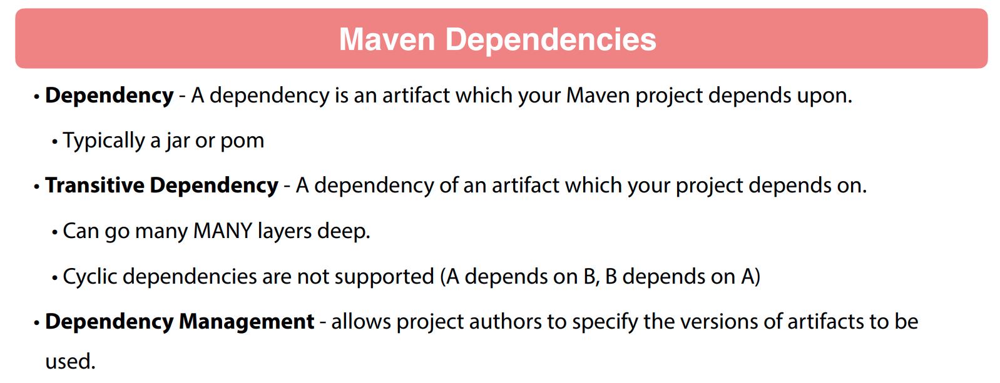
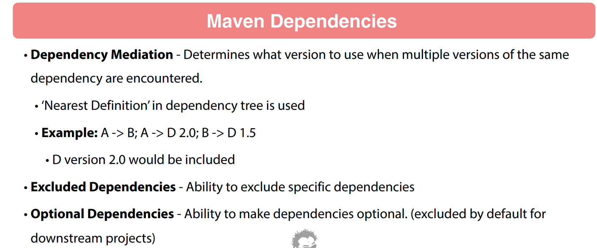
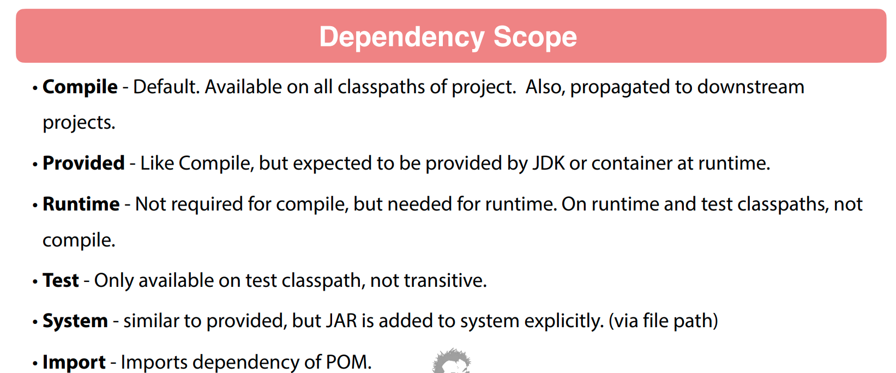
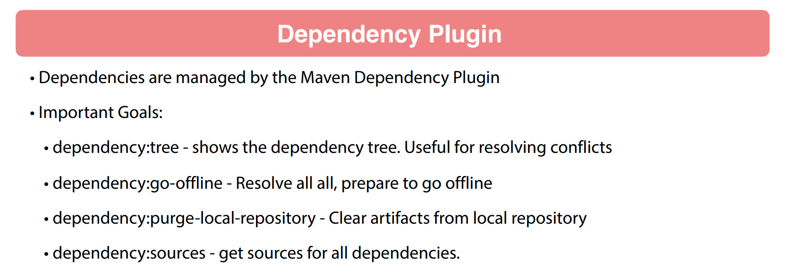
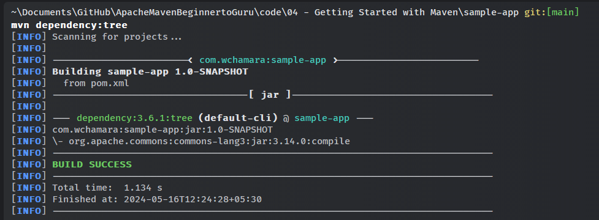

## 007 Maven Standard Directory Layout

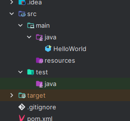
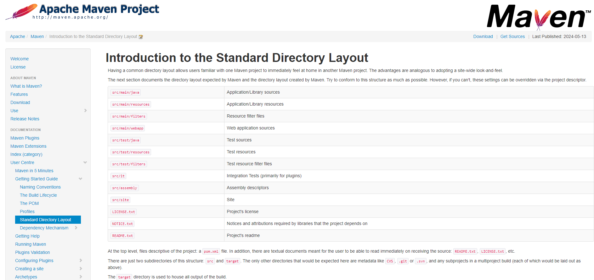
<https://maven.apache.org/guides/introduction/introduction-to-the-standard-directory-layout.html>

## 008 Maven Build Lifecycles

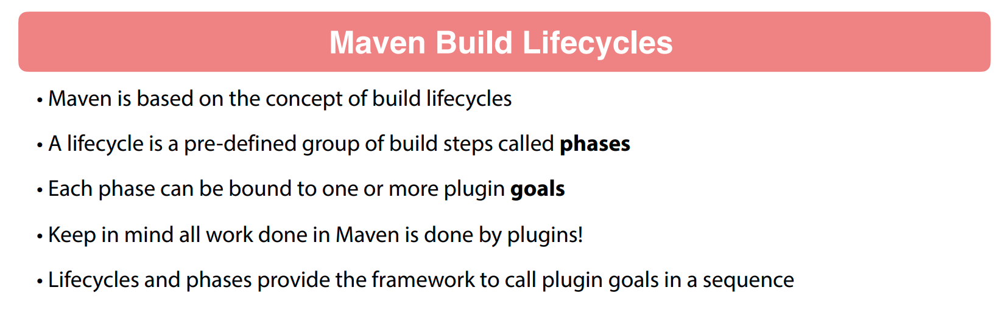
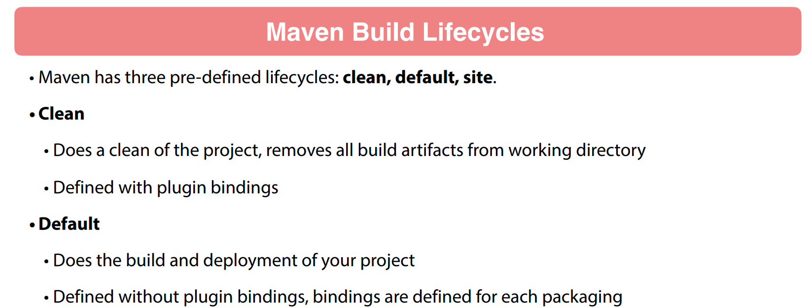
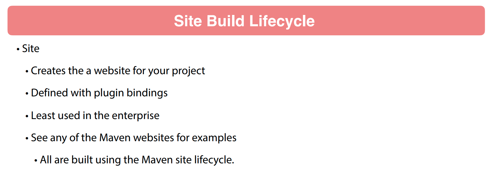
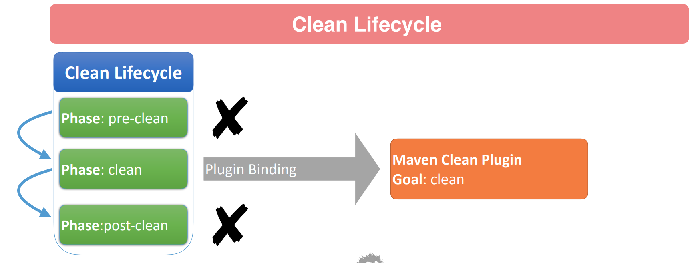
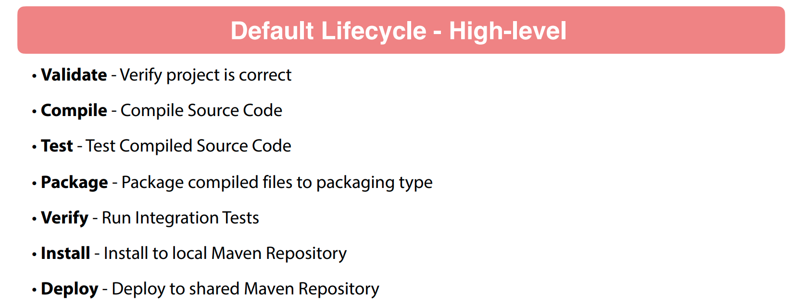
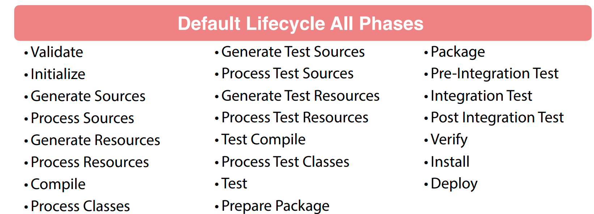
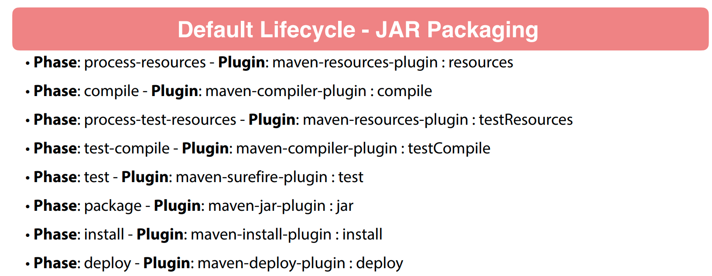
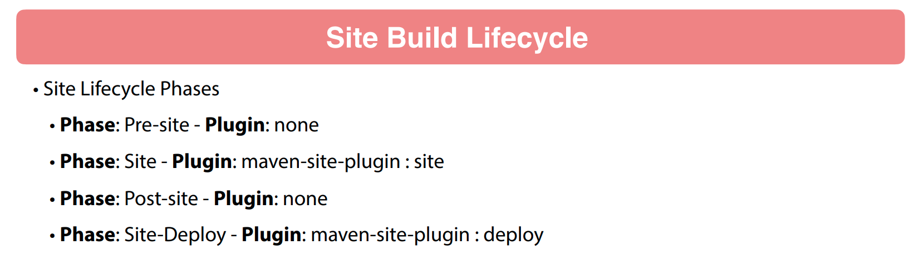

## 009 Maven Wrapper

adding maven wrapper to the project.

```bash
mvn -N io.takari:maven:wrapper -Dmaven=3.9.6
```

## 010 Maven Archetypes

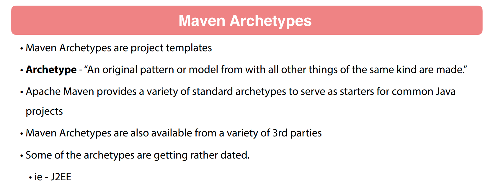

<https://maven.apache.org/archetypes/maven-archetype-simple/>

```bash
mvn archetype:generate -DarchetypeGroupId=org.apache.maven.archetypes -DarchetypeArtifactId=maven-archetype-simple -DarchetypeVersion=1.4
```
