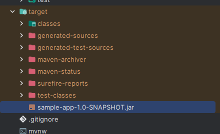

# 06 - Common Maven Plugins

## 002 Overview Maven Lifecycle Plugins


## 003 Maven Clean Plugin

```xml
<?xml version="1.0" encoding="UTF-8"?>
<project xmlns="http://maven.apache.org/POM/4.0.0"
         xmlns:xsi="http://www.w3.org/2001/XMLSchema-instance"
         xsi:schemaLocation="http://maven.apache.org/POM/4.0.0 http://maven.apache.org/xsd/maven-4.0.0.xsd">
    <modelVersion>4.0.0</modelVersion>

    <groupId>com.wchamara</groupId>
    <artifactId>sample-app</artifactId>
    <version>1.0-SNAPSHOT</version>

    <properties>
        <project.build.sourceEncoding>UTF-8</project.build.sourceEncoding>
        <project.reporting.outputEncoding>UTF-8</project.reporting.outputEncoding>
        <java.version>21</java.version>
        <maven.compiler.source>${java.version}</maven.compiler.source>
        <maven.compiler.target>${java.version}</maven.compiler.target>
    </properties>
    <dependencies>
        <dependency>
            <groupId>org.apache.commons</groupId>
            <artifactId>commons-lang3</artifactId>
            <version>3.14.0</version>
        </dependency>

    </dependencies>
    <build>
        <plugins>
            <plugin>
                <groupId>org.apache.maven.plugins</groupId>
                <artifactId>maven-clean-plugin</artifactId>
                <version>3.3.2</version>
                <executions>
                    <execution>
                        <id>auto-clean</id>
                        <phase>initialize</phase>
                        <goals>
                            <goal>clean</goal>
                        </goals>
                    </execution>
                </executions>
            </plugin>

        </plugins>
    </build>

</project>
```

by adding the bellow code to the pom.xml file, we can run the following command to clean the project.

```xml
<build>
        <plugins>
            <plugin>
                <groupId>org.apache.maven.plugins</groupId>
                <artifactId>maven-clean-plugin</artifactId>
                <version>3.3.2</version>
                <executions>
                    <execution>
                        <id>auto-clean</id>
                        <phase>initialize</phase>
                        <goals>
                            <goal>clean</goal>
                        </goals>
                    </execution>
                </executions>
            </plugin>

        </plugins>
    </build>
```

```bash
mvn package
```


The selected code is a part of a Maven `pom.xml` file, specifically the `<build>` section. This section is used to configure aspects related to the build system of a Maven project.

```xml
<build>
    <plugins>
        ...
    </plugins>
</build>
```

Inside the `<build>` tag, there is a `<plugins>` tag. This is where you define the plugins that Maven will use during the build process. Each plugin is defined within a `<plugin>` tag.

```xml
<plugins>
    <plugin>
        ...
    </plugin>
</plugins>
```

In this case, the `maven-clean-plugin` is being used. This plugin is responsible for cleaning the project's build directories to ensure a clean slate before starting the build process.

```xml
<plugin>
    <groupId>org.apache.maven.plugins</groupId>
    <artifactId>maven-clean-plugin</artifactId>
    <version>3.3.2</version>
    ...
</plugin>
```

The `<executions>` tag inside the `<plugin>` tag is used to specify different build phases where this plugin should be executed. In this case, the plugin is set to run during the `initialize` phase of the build lifecycle, which is the phase before the actual build process starts.

```xml
<executions>
    <execution>
        <id>auto-clean</id>
        <phase>initialize</phase>
        <goals>
            <goal>clean</goal>
        </goals>
    </execution>
</executions>
```

The `<goal>` tag specifies the goal of the plugin, which is the task it is supposed to perform. For the `maven-clean-plugin`, the `clean` goal is used, which means it will delete the build directory of the project.

## 004 Maven Compiler Plugin


## 005 Maven Resources Plugin


<https://maven.apache.org/plugins/maven-resources-plugin/examples/resource-directory.html>

## 006 Maven Surefire Plugin


## 007 Maven Jar Plugin

```xml
            <plugin>
                <groupId>org.apache.maven.plugins</groupId>
                <artifactId>maven-jar-plugin</artifactId>
                <version>3.3.0</version>
                <configuration>
                    <archive>
                        <manifest>
                            <addClasspath>true</addClasspath>
                            <mainClass>HelloWorld</mainClass>
                        </manifest>
                    </archive>
                </configuration>
            </plugin>
```

we can add the above code to the pom.xml file to create a jar file with the main class.


## 008 Maven Deploy Plugin

maven deploy plugin is used to deploy the project to the remote repository.

```xml
            <plugin>
                <groupId>org.apache.maven.plugins</groupId>
                <artifactId>maven-deploy-plugin</artifactId>
                <version>3.0.0-M1</version>
                <configuration>
                    <altDeploymentRepository>internal.repo::default::file:///${project.build.directory}/mvn-repo</altDeploymentRepository>
                </configuration>
            </plugin>
```

## 009 Maven Site Plugin

maven site plugin is used to generate a site for the project.

## 010 Maven and Source Control

igignore sample file for maven project.

```.gitignore
# Maven target directory
target/

# Eclipse project files
.classpath
.project
.settings/

# IntelliJ project files
.idea/
*.iml
*.iws
*.ipr
```

## 011 Other Maven Plugins

## 012 Common Maven Commands and CheatSheet


