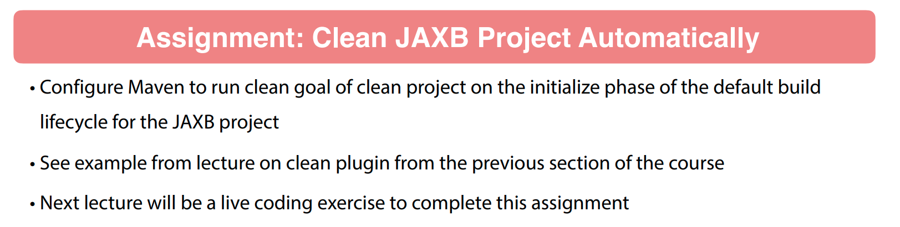

# Generating Source with Maven

## 002 XSD to Java with Maven

```xsd
<?xml version="1.0"?>
<xsd:schema xmlns:xsd="http://www.w3.org/2001/XMLSchema"
            xmlns:jaxb="http://java.sun.com/xml/ns/jaxb" jaxb:version="2.0">

    <!--This tells JAXB what package to create the Java classes in-->
    <xsd:annotation>
        <xsd:appinfo>
            <jaxb:schemaBindings>
                <jaxb:package name="guru.springframework.domain"/>
            </jaxb:schemaBindings>
        </xsd:appinfo>
    </xsd:annotation>

    <xsd:complexType name="Product">
        <xsd:sequence>
            <xsd:element name="productId" type="xsd:integer"/>
            <xsd:element name="productDescription" type="xsd:string"/>
            <xsd:element name="productPrice" type="xsd:decimal"/>
        </xsd:sequence>
    </xsd:complexType>

    <xsd:complexType name="CreateProductRequest">
        <xsd:complexContent>
            <xsd:extension base="Product">
                <xsd:attribute name="apikey" type="xsd:string"/>
            </xsd:extension>
        </xsd:complexContent>
    </xsd:complexType>

</xsd:schema>
```

```xml
<?xml version="1.0" encoding="UTF-8"?>
<project xmlns="http://maven.apache.org/POM/4.0.0"
         xmlns:xsi="http://www.w3.org/2001/XMLSchema-instance"
         xsi:schemaLocation="http://maven.apache.org/POM/4.0.0 http://maven.apache.org/xsd/maven-4.0.0.xsd">
    <modelVersion>4.0.0</modelVersion>

    <groupId>com.wchamara</groupId>
    <artifactId>jaxb-project</artifactId>
    <version>1.0-SNAPSHOT</version>

    <properties>
        <maven.compiler.source>21</maven.compiler.source>
        <maven.compiler.target>21</maven.compiler.target>
        <project.build.sourceEncoding>UTF-8</project.build.sourceEncoding>
        <jaxb2.version>2.3.3</jaxb2.version>
    </properties>
    <dependencies>
        <dependency>
            <groupId>javax.xml.bind</groupId>
            <artifactId>jaxb-api</artifactId>
            <version>2.3.1</version>
        </dependency>
    </dependencies>
    <build>
        <plugins>
            <plugin>
                <groupId>org.jvnet.jaxb2.maven2</groupId>
                <artifactId>maven-jaxb2-plugin</artifactId>
                <version>0.15.3</version>
                <executions>
                    <execution>
                        <goals>
                            <goal>generate</goal>
                        </goals>
                    </execution>
                </executions>
            </plugin>
        </plugins>
    </build>
</project>
```

by adding this plugin to the `pom.xml` file, we can generate the java classes from the xsd file.

```java

```


## 003 Assignment - Clean JAXB Project Automatically



## 004 Assignment Review - Clean JAXB Project Automatically

```xml
            <plugin>
                <artifactId>maven-clean-plugin</artifactId>
                <version>3.3.2</version>
                <executions>
                    <execution>
                        <id>auto-clean</id>
                        <phase>initialize</phase>
                        <goals>
                            <goal>clean</goal>
                        </goals>
                    </execution>
                </executions>
            </plugin>
```

## 005 Using Maven to Generate Java Classes from JSON Schema

```json
{
  "$schema": "http://json-schema.org/draft-07/schema#",
  "type": "object",
  "properties": {
    "post-office-box": {
      "type": "string"
    },
    "extended-address": {
      "type": "string"
    },
    "street-address": {
      "type": "string"
    },
    "locality": {
      "type": "string"
    },
    "region": {
      "type": "string"
    },
    "postal-code": {
      "type": "string"
    },
    "country-name": {
      "type": "string"
    }
  },
  "required": [ "locality", "region", "country-name" ],
  "dependencies": {
    "post-office-box": [ "street-address" ],
    "extended-address": [ "street-address" ]
  }
}
```

```xml
<?xml version="1.0" encoding="UTF-8"?>
<project xmlns="http://maven.apache.org/POM/4.0.0"
         xmlns:xsi="http://www.w3.org/2001/XMLSchema-instance"
         xsi:schemaLocation="http://maven.apache.org/POM/4.0.0 http://maven.apache.org/xsd/maven-4.0.0.xsd">
    <modelVersion>4.0.0</modelVersion>

    <groupId>com.wchamara</groupId>
    <artifactId>mb2-json-schema</artifactId>
    <version>1.0-SNAPSHOT</version>

    <properties>
        <maven.compiler.source>21</maven.compiler.source>
        <maven.compiler.target>21</maven.compiler.target>
        <project.build.sourceEncoding>UTF-8</project.build.sourceEncoding>
    </properties>
    
    <dependencies>
        <dependency>
            <groupId>org.apache.commons</groupId>
            <artifactId>commons-lang3</artifactId>
            <version>3.14.0</version>
        </dependency>
        <dependency>
            <groupId>com.fasterxml.jackson.core</groupId>
            <artifactId>jackson-databind</artifactId>
            <version>2.16.1</version>
        </dependency>
    </dependencies>
    <build>
        <plugins>
            <plugin>
                <groupId>org.jsonschema2pojo</groupId>
                <artifactId>jsonschema2pojo-maven-plugin</artifactId>
                <version>1.2.1</version>
                <configuration>
                    <sourceDirectory>${basedir}/src/main/resources/schema</sourceDirectory>
                    <targetPackage>com.wchamara.types</targetPackage>
                    <useCommonsLang3>true</useCommonsLang3>
                </configuration>
                <executions>
                    <execution>
                        <goals>
                            <goal>generate</goal>
                        </goals>
                    </execution>
                </executions>
            </plugin>
        </plugins>
    </build>
</project>
```

## 006 Challenge - Create Project Lombok Project with Maven

## 007 Generating Java Classes with Project Lombok and Maven

## 008 Challenge - Create MapStruct Project with Maven

## 009 Generating Java Classes with MapStruct and Maven
